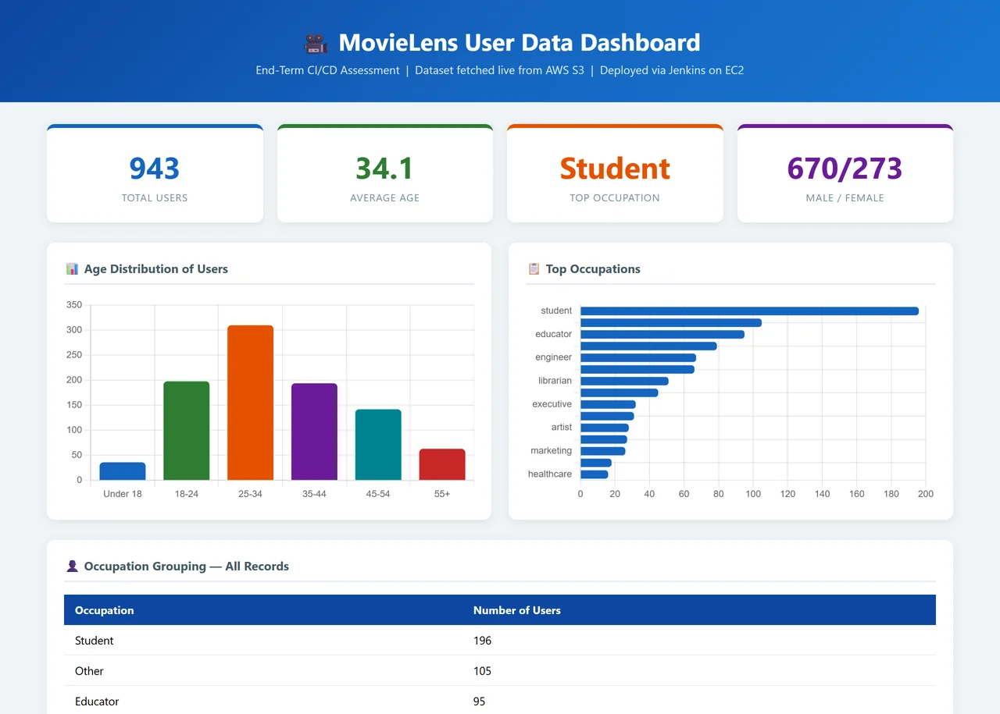
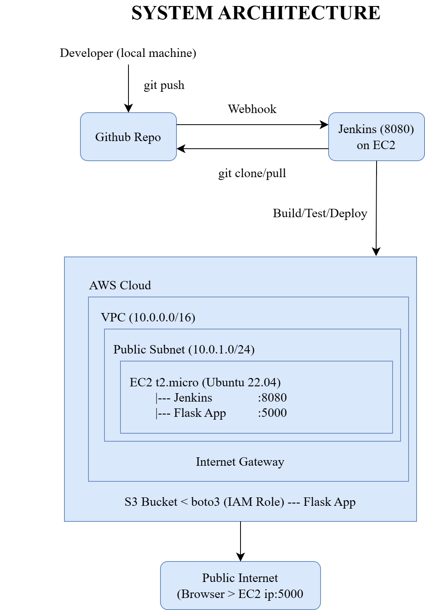
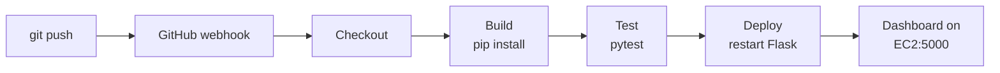

<div align="center">

# Jenkins CI/CD Pipeline on AWS

A Flask analytics dashboard that Jenkins builds, tests and redeploys on an EC2 instance<br>
every time code is pushed to GitHub. The app reads its dataset from S3 through an IAM role.

[![Jenkins][badge-jenkins]][link-jenkins]
[![Python][badge-python]][link-python]
[![Flask][badge-flask]][link-flask]
[![AWS EC2][badge-ec2]][link-ec2]
[![AWS S3][badge-s3]][link-s3]
[![AWS VPC][badge-vpc]][link-vpc]
[![pytest][badge-pytest]][link-pytest]
[![Chart.js][badge-chartjs]][link-chartjs]
[![License: MIT][badge-license]](LICENSE)



</div>

## About

I built this for a DevOps course to practise a complete deployment path on AWS. A push to GitHub fires a webhook, Jenkins on an EC2 instance pulls the code, installs dependencies, runs the tests and restarts the Flask app, and the app serves a dashboard built from the MovieLens user dataset stored in S3. The instance sits in a custom VPC and reads from S3 with an IAM role, so no AWS keys live in the code or on the server.

## Architecture

<p align="center">
  
</p>

| Piece | Setup |
|---|---|
| Network | Custom VPC `10.0.0.0/16` with a public subnet `10.0.1.0/24`, an internet gateway, a route table sending `0.0.0.0/0` to the gateway, and a security group for SSH, Jenkins and the app |
| Compute | One `t2.micro` instance running Ubuntu 22.04, hosting both Jenkins (port 8080) and the Flask app (port 5000) |
| Storage | An S3 bucket in `ap-south-1` holding `u.user` |
| Access | An IAM role with `AmazonS3ReadOnlyAccess` attached to the instance; boto3 picks up its credentials automatically |
| CI/CD | Jenkins, installed from the official Debian repository, running a pipeline job defined by the `Jenkinsfile` in this repo and triggered by a GitHub webhook |

## Pipeline



| Stage | What the `Jenkinsfile` runs |
|---|---|
| Checkout | Clones the `main` branch of this repository |
| Build | `sudo pip3 install -r requirements.txt --break-system-packages` |
| Test | `python3 -m pytest test_app.py -v --tb=short` |
| Deploy | Stops any running `python3 app.py`, starts it again in the background with `nohup` (logging to `/tmp/flask_app.log`), waits four seconds and fails the build if the process is not running |

A failing test stops the pipeline before the deploy stage, so a broken commit never replaces the running app. After every run Jenkins prints whether it succeeded and when it finished. The build step needs `sudo` because Jenkins runs as the `jenkins` user; the server has a one-time sudo rule that lets it run `pip3`.

## The app

`app.py` has a single route. On each request it downloads `u.user` from S3 with boto3, loads it into pandas and computes:

- the total number of users, the average age, the most common occupation and the male/female split
- users per age band (under 18, 18 to 24, 25 to 34, 35 to 44, 45 to 54 and 55+)
- the 15 most common occupations

`templates/index.html` renders those numbers as four stat cards, two Chart.js bar charts and an occupation table.

The tests in `test_app.py` are smoke tests for the pipeline: they check that Flask, pandas and boto3 import, that the app object builds, and that a Flask test client can be created. They do not call S3.

## Running it yourself

### Locally

You need Python 3 and AWS credentials that can read the bucket (an AWS CLI profile works).

```bash
git clone https://github.com/RudraSomaiya/DevOps2-EndTerm.git
cd DevOps2-EndTerm
pip install -r requirements.txt
python app.py               # http://localhost:5000
python -m pytest test_app.py -v
```

The bucket name, object key and region are constants at the top of `app.py` (`S3_BUCKET`, `S3_KEY`, `REGION`). Point them at your own bucket.

### Dataset

The app expects the `u.user` file from the [MovieLens 100K dataset](https://grouplens.org/datasets/movielens/100k/) (943 users, pipe-separated: user id, age, gender, occupation and zip code). The GroupLens licence does not allow redistributing the data, so download it from GroupLens and upload it to your bucket:

```bash
aws s3 cp u.user s3://<your-bucket>/u.user
```

### On AWS

1. Create the VPC, public subnet, internet gateway, route table and security group described above.
2. Create an IAM role for EC2 with `AmazonS3ReadOnlyAccess` and attach it to the instance.
3. Launch an Ubuntu 22.04 instance in the public subnet and install Java 17, Python 3, pip and Git.
4. Install Jenkins from the official Debian repository, enable the service, and allow the `jenkins` user to run `pip3` with `sudo`.
5. Create a Jenkins pipeline job that reads the `Jenkinsfile` from this repository, then add a GitHub webhook that points at the Jenkins server.
6. Push a commit. Once the pipeline goes green, the dashboard is live at `http://<ec2-public-ip>:5000`.

## Project layout

```
.
├── app.py                Flask app: fetch from S3, compute stats, render the dashboard
├── templates/index.html  Dashboard template (stat cards, Chart.js charts, table)
├── test_app.py           Smoke tests run by the Test stage
├── Jenkinsfile           Checkout, Build, Test and Deploy stages
├── requirements.txt
├── system-arch.png       Architecture diagram (source: system-arch.drawio)
└── docs/images/          Screenshot used in this README
```

## Limitations

- The app downloads the whole file from S3 on every page load. Caching it in memory would remove that round trip.
- Deployment means restarting a background process on the Jenkins machine, so each deploy causes a few seconds of downtime, and Jenkins and the app share one small instance. A production setup would run the app under a process manager (or in a container) on separate hosts.
- The tests only cover imports and app creation; there is no test of the dashboard route with mocked S3 data.

## License

Code released under the [MIT License](LICENSE). The MovieLens data is not included and remains under the GroupLens terms.

## Author

Made by Rudra Somaiya.

[![GitHub][badge-github]][link-github]
[![LinkedIn][badge-linkedin]][link-linkedin]

[badge-jenkins]: https://img.shields.io/badge/Jenkins-D24939?style=for-the-badge&logo=jenkins&logoColor=white
[badge-python]: https://img.shields.io/badge/Python-3-3776AB?style=for-the-badge&logo=python&logoColor=white
[badge-flask]: https://img.shields.io/badge/Flask-000000?style=for-the-badge&logo=flask&logoColor=white
[badge-ec2]: https://img.shields.io/badge/AWS-EC2-FF9900?style=for-the-badge
[badge-s3]: https://img.shields.io/badge/AWS-S3-569A31?style=for-the-badge
[badge-vpc]: https://img.shields.io/badge/AWS-VPC-8C4FFF?style=for-the-badge
[badge-pytest]: https://img.shields.io/badge/pytest-0A9EDC?style=for-the-badge&logo=pytest&logoColor=white
[badge-chartjs]: https://img.shields.io/badge/Chart.js-FF6384?style=for-the-badge&logo=chartdotjs&logoColor=white
[badge-license]: https://img.shields.io/badge/License-MIT-F7DF1E?style=for-the-badge
[badge-github]: https://img.shields.io/badge/GitHub-RudraSomaiya-181717?style=for-the-badge&logo=github&logoColor=white
[badge-linkedin]: https://img.shields.io/badge/LinkedIn-Rudra_Somaiya-0A66C2?style=for-the-badge&logo=data:image/svg%2bxml;base64,PHN2ZyB4bWxucz0iaHR0cDovL3d3dy53My5vcmcvMjAwMC9zdmciIHZpZXdCb3g9IjAgMCAyNCAyNCI+PHBhdGggZmlsbD0iI2ZmZiIgZD0iTTIwLjQ1IDIwLjQ1aC0zLjU2di01LjU3YzAtMS4zMy0uMDItMy4wNC0xLjg1LTMuMDQtMS44NSAwLTIuMTQgMS40NS0yLjE0IDIuOTR2NS42N0g5LjM1VjloMy40MXYxLjU2aC4wNWMuNDgtLjkgMS42NC0xLjg1IDMuMzctMS44NSAzLjYgMCA0LjI3IDIuMzcgNC4yNyA1LjQ2djYuMjh6TTUuMzQgNy40M2EyLjA2IDIuMDYgMCAxIDEgMC00LjEyIDIuMDYgMi4wNiAwIDAgMSAwIDQuMTJ6TTcuMTIgMjAuNDVIMy41NlY5aDMuNTZ2MTEuNDV6TTIyLjIyIDBIMS43N0MuNzkgMCAwIC43NyAwIDEuNzN2MjAuNTRDMCAyMy4yMy43OSAyNCAxLjc3IDI0aDIwLjQ1Yy45OCAwIDEuNzgtLjc3IDEuNzgtMS43M1YxLjczQzI0IC43NyAyMy4yIDAgMjIuMjIgMHoiLz48L3N2Zz4=
[link-jenkins]: https://www.jenkins.io
[link-python]: https://www.python.org
[link-flask]: https://flask.palletsprojects.com
[link-ec2]: https://aws.amazon.com/ec2/
[link-s3]: https://aws.amazon.com/s3/
[link-vpc]: https://aws.amazon.com/vpc/
[link-pytest]: https://pytest.org
[link-chartjs]: https://www.chartjs.org
[link-github]: https://github.com/RudraSomaiya
[link-linkedin]: https://www.linkedin.com/in/rudra-somaiya/
